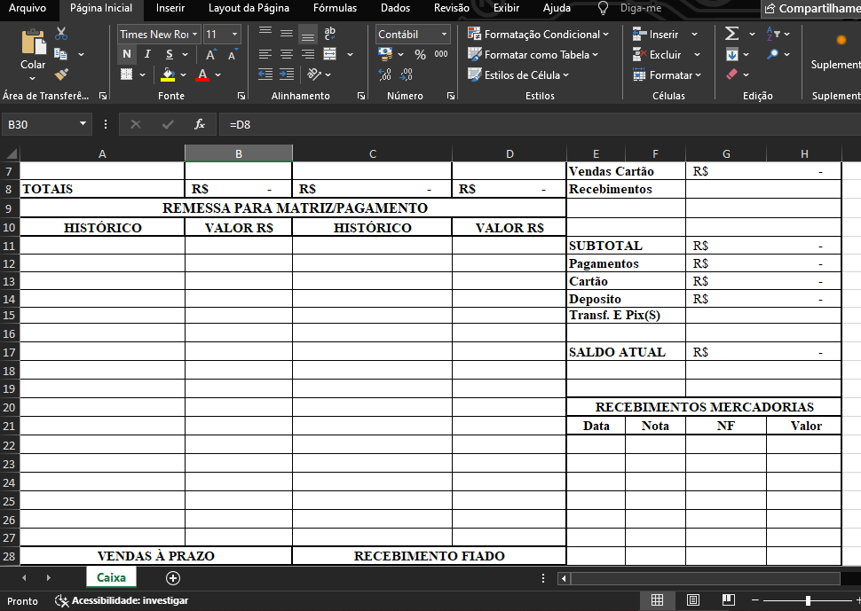
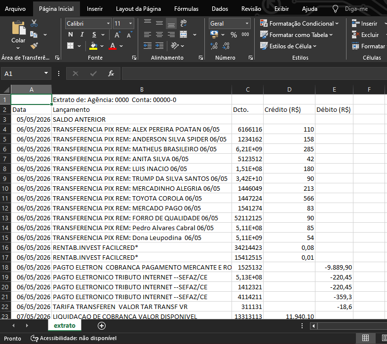
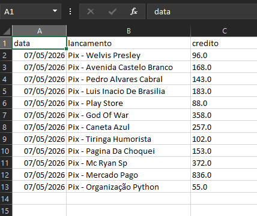
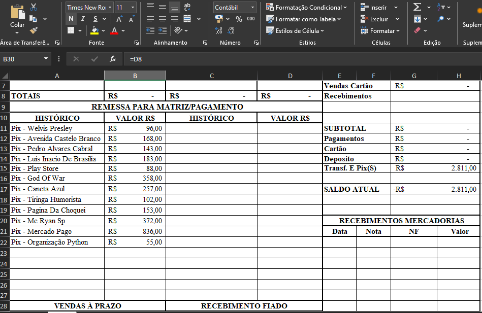

# Automação de Caixa – Python + Excel

Automação em Python para leitura, padronização e escrita de dados de extrato em um modelo de caixa, com foco em transformar arquivos brutos em uma saída organizada e pronta para conferência.

> **Observação importante:** os nomes oficiais utilizados no ambiente real foram alterados neste projeto. Para preservar a empresa e evitar exposição de informações sensíveis, foram usados nomes de celebridades brasileiras, nomes engraçados e referências totalmente fora de contexto.

## Objetivo

Este projeto foi construído para automatizar o processamento de extratos e preencher um modelo de caixa em Excel a partir de arquivos brutos. A ideia central é reduzir trabalho manual, padronizar a saída e deixar o fluxo mais confiável para conferência e uso operacional.

## Estrutura do projeto

```text
AUTOMACAO_CAIXA/
├── data/
│   ├── processed/
│   └── raw/
│       └── extrato.csv
├── docs/
│   └── images/
│       ├── tabela_modelo.PNG
│       ├── foto_extrato_raw.PNG
│       ├── foto_extrato_processed.PNG
│       └── caixa_preenchido.PNG
├── notebooks/
│   └── eda_inicial.ipynb
├── output/
│   └── Caixa 07-05-2026.xlsx
├── src/
│   ├── __pycache__/
│   ├── __init__.py
│   ├── config_example.py
│   ├── config.py
│   ├── escritor_caixa.py
│   ├── leitor_bradesco.py
│   ├── main.py
│   ├── processamento_pix.py
│   └── utils.py
├── templates/
│   └── modelo_caixa.xlsx
├── venv/
├── .gitignore
├── LICENSE
├── README.md
└── requirements.txt
```

## Organização das pastas

### `data/`
Armazena os dados usados no fluxo.

- `raw/`: recebe os arquivos brutos, como o extrato original.
- `processed/`: pode ser usado para salvar dados intermediários ou já tratados antes da exportação final.

### `notebooks/`
Espaço para análises exploratórias e validações manuais.

- `eda_inicial.ipynb`: notebook usado para entender o formato do extrato, testar ideias e validar regras antes de consolidar a lógica no código principal.

### `output/`
Contém os arquivos gerados pela automação.

- Exemplo: `Caixa 07-05-2026.xlsx`, que representa a saída final já preenchida a partir do processamento.

### `src/`
Contém o código-fonte principal do projeto.

- `main.py`: ponto de entrada da aplicação.
- `leitor_bradesco.py`: leitura e interpretação do extrato bruto.
- `processamento_pix.py`: tratamento específico de lançamentos relacionados a PIX.
- `escritor_caixa.py`: responsável por escrever os dados processados no modelo Excel.
- `config.py`: configurações usadas na execução local.
- `config_example.py`: exemplo de configuração para replicação do ambiente.
- `utils.py`: funções auxiliares reutilizadas em diferentes partes do fluxo.
- `__init__.py`: marcação do pacote Python.

### `templates/`
Guarda os modelos-base usados pela automação.

- `modelo_caixa.xlsx`: planilha modelo que recebe os dados já tratados.

## Fluxo do processamento

De forma geral, o projeto segue este caminho:

1. Um extrato bruto é colocado em `data/raw/`.
2. O arquivo é lido e interpretado pelo módulo de leitura.
3. As informações passam por tratamento e padronização, incluindo regras específicas para PIX.
4. Os dados consolidados são escritos no arquivo modelo.
5. O resultado final é salvo na pasta `output/`.

## Exemplo visual do processo

### 1. Modelo antes do preenchimento





### 2. Extrato bruto recebido





### 3. Tabela processada





### 4. Modelo depois do preenchimento





## Exemplo de uso

A execução principal é feita pelo arquivo `main.py`.

```bash
python -m src.main
```

Dependendo de como o projeto estiver configurado localmente, também pode ser executado com:

```bash
python src/main.py
```

## Requisitos

As dependências do projeto estão listadas em `requirements.txt`.

Para instalar:

```bash
pip install -r requirements.txt
```

## Observações sobre o desenvolvimento

Alguns pontos importantes sobre a construção deste projeto:

- O notebook em `notebooks/` indica que houve uma etapa de exploração inicial dos dados antes da implementação final.
- A separação entre leitura, processamento e escrita mostra uma organização boa do fluxo, deixando o projeto mais fácil de manter.
- A existência de um template Excel separado da lógica principal ajuda a reduzir acoplamento.
- O uso de um módulo específico para PIX sugere que esse tipo de lançamento exigiu tratamento dedicado.

## Possíveis melhorias

Algumas evoluções que podem deixar o projeto ainda mais robusto:

- Adicionar testes automatizados para os tratamentos principais.
- Criar validações para garantir que o extrato recebido tenha o formato esperado.
- Salvar arquivos intermediários tratados em `data/processed/` para facilitar auditoria.
- Documentar melhor os parâmetros de configuração em `config_example.py`.
- Padronizar logs para facilitar depuração em execução real.

## Licença

O projeto possui um arquivo `LICENSE` na raiz. Consulte esse arquivo para verificar os termos de uso.
